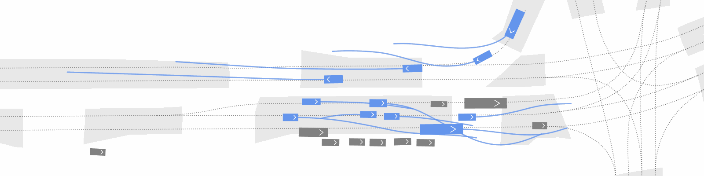

<div align="center">
<a href="images/main.png">
    
</a>

  <h3>GAN-Inspired Trajectory Generation by Inverse Reinforcement Learning-Informed Diffusion</h3>
</div>

## Table of Contents
- [Methods](#methods)
- [Simulation Results](#simulation-results)
- [Project Structure](#project-structure)
- [Getting Started](#getting-started)
- [License](#license)

## Methods
DiffGAN is a novel generative adversarial diffusion framework that combines diffusion models with inverse reinforcement learning (IRL) for realistic and diverse agent behavior modeling in autonomous vehicle simulation.

### Core Architecture
- **Generator:** Diffusion Model-based trajectory generation system that creates candidate trajectories for MaxEntIRL, with the inferred rewards used to guide the diffusion process.
- **Discriminator:** Maximum Entropy Inverse Reinforcement Learning implementation for inferring reward feature weights using linear combinations of features.

### Advantages
- Bridges the gap between discriminative learning (high realism) and generative learning (multimodal diversity).
- Produces agent behaviors that are both human-like and diverse

<a href="images/Diffgan.png">
  
</a>

## Simulation Results
<details open>
  <summary><strong>Simulation on nuScenes-Boston</strong></summary>
  <br>
  <p align="center">
  <a href="images/b40.gif">
    
  </a>
  <a href="images/b74.gif">
    
  </a>
  <a href="images/b52.gif" target="_blank">
    
  </a>
  </p>
</details>
<details open>
  <summary><strong>Simulation on nuScenes-Singapore</strong></summary>
  <br>
  <p align="center">
  <a href="images/s13.gif">
    
  </a>
  <a href="images/s30.gif">
    
  </a>
  <a href="images/s24.gif">
    
  </a>
  </p>
</details>

## Project Structure
```
DiffGan/
├── MaxEntIRL/                      # Maximum Entropy IRL implementation
├── DiffusionGan/                   # Diffusion-based trajectory generation
├── CTG/                
│   └── tbsim/                      # Core simulation and model framework
├── behavior-generation-dataset/    # Dataset
│   └── nuscenes/   
├── scripts/
├── sh/                             # dmog shell
├── config/                         # Configs for training and test
├── train_results/                  # Save checkpoints for Discriminator
└── checkpoints/                    # Save checkpoints for Generator (CTG)
```

## Getting Started
### Basic Installation (mainly based on tbsim)
```bash
# Create conda environment
conda create -n bg3.9 python=3.9
conda activate bg3.9

# Clone DiffGan (this repo)
git clone https://github.com/RoboSafe-Lab/DiffGan.git
cd DiffGan

# Install CTG
cd CTG
pip install -e . --config-settings editable_mode=compat

# Install a customized version of trajdata
cd ..
git clone https://github.com/AIasd/trajdata.git
cd trajdata
pip install -r trajdata_requirements.txt
pip install -e . --config-settings editable_mode=compat

# Install Pplan
cd ..
git clone https://github.com/NVlabs/spline-planner.git Pplan
cd Pplan
pip install -e . --config-settings editable_mode=compat

# Install ffmpeg
cd ..
wget https://johnvansickle.com/ffmpeg/releases/ffmpeg-release-amd64-static.tar.xz
tar -xJf ffmpeg-release-amd64-static.tar.xz
```
### Potential Issue
One might need to run the following:
```bash
pip install torch==1.11.0+cu113 torchvision==0.12.0+cu113 torchaudio==0.11.0 torchmetrics==0.11.1 torchtext --extra-index-url https://download.pytorch.org/whl/cu113
```

### Obtain Dataset
We currently support the [nuScenes](https://www.nuscenes.org/nuscenes) dataset.
* Download the nuScenes dataset and organize the dataset directory as follows:
    ```
    nuscenes/
    ├── maps/
    ├── v1.0-mini/
    └── v1.0-trainval/
    ```
* Use the examples in `trajdata` to preprocess the data:
    ```bash
    python trajdata/examples/preprocess_data.py
    ```
    
### Train Diffusion Model    
Follow [this](CTG/README.md#2-train-a-diffuser-model) to train the diffuser model:
```bash
python CTG/scripts/train.py --dataset_path <path-to-dataset> --config_name trajdata_nusc_diff --debug
```
After that, you will find the trained weights in `diffuser_trained_models/`. Please move this folder to `checkpoints/` directory.

### Training
Before start training, ensure that you get the checkpoint of diffusion model and put it in the correct place. Please check the config in `config/MaxEntIRL.json` or create your own config file (follow [this](config/README.md) to get the details about config). 
```bash
python -m scripts.train --config <path-to-config-file>

# For example, use our config file
python -m scripts.train --config config/MaxEntIRL.json
```

### Closed-loop Evaluation
You can use the following command to evaluate the trained model or our provided [checkpoint](#pre-trained-models). Please check the config in `config/MaxEntIRL.json` or create your own config file (follow [this](config/README.md) to get the details about config). 
```bash
# Add ffmpeg directly to PATH
export PATH=<path-to-ffmpeg>
python -m scripts.infer --config <path-to-config-file>

# For example, use our config file
export PATH=$HOME/DiffGan/ffmpeg-7.0.2-amd64-static:$PATH
python -m scripts.infer --config config/MaxEntIRL.json
```
You can use the following command to create a gif with the style we have shown:
```bash
python generate_gif.py --hdf5 <path-to-hdf5> --output <output-file-name> --scene-idx <idx-in-hdf5>
```

### Parse Metrics
```bash
python scripts/calcalate_metrics.py --hdf5_dir <path-to-hdf5-file> --dataset_dir <path-to-dataset> --output_dir <path-to-output-dir>
```

### Pre-trained Models
We have provided checkpoints for discriminator in `\train_results`.

### Hyperparameters
<div align="center">
<table>
  <thead>
    <tr>
      <th rowspan="2">Hyperparameter</th>
      <th colspan="2">nuScenes</th>
      <th colspan="2">nuPlan</th>
    </tr>
    <tr>
      <th>Boston</th>
      <th>Singapore</th>
      <th>Boston</th>
      <th>Singapore</th>
    </tr>
  </thead>
  <tbody>
    <tr>
      <td>Number of Training Episodes</td>
      <td colspan="1" align="center">10</td>
      <td colspan="1" align="center">21</td>
      <td colspan="2" align="center">-</td>
    </tr>
    <tr>
      <td>Number of Test Episodes</td>
        <td colspan="1" align="center">67</td>
        <td colspan="1" align="center">52</td>
        <td colspan="1" align="center">100</td>
        <td colspan="1" align="center">92</td>
    </tr>
    <tr>
      <td>Training Iterations of Reward (ITER_N)</td>
      <td colspan="2" align="center">100</td> <td colspan="2" align="center">-</td>
    </tr>
    <tr>
      <td>IRL Sub-optimization Iterations (IRL_N)</td>
      <td colspan="2" align="center">100</td> <td colspan="2" align="center">-</td>
    </tr>
    <tr>
      <td>Number of Rollouts (M)</td>
      <td colspan="2" align="center">8</td> <td colspan="2" align="center">-</td>
    </tr>
    <tr>
      <td>Learning Rate</td>
      <td colspan="2" align="center">0.0001</td> <td colspan="2" align="center">-</td>
    </tr>
    <tr>
      <td>Planning Horizon</td>
      <td colspan="4" align="center">50</td>
    </tr>
    <tr>
      <td>History Sec.</td>
      <td colspan="4" align="center">3.0</td>
    </tr>
    <tr>
      <td>Future Sec.</td>
      <td colspan="4" align="center">5.2</td>
    </tr>
    <tr>
      <td>Step Time</td>
      <td colspan="4" align="center">0.1</td>
    </tr>
  </tbody>
</table>
</div>


## License
This project is based on and partially derived from [CTG](https://github.com/NVlabs/CTG), which is released under the NVIDIA License.
All modifications and additional code in this repository are also released under the NVIDIA License and are restricted to non-commercial research and evaluation purposes only.


