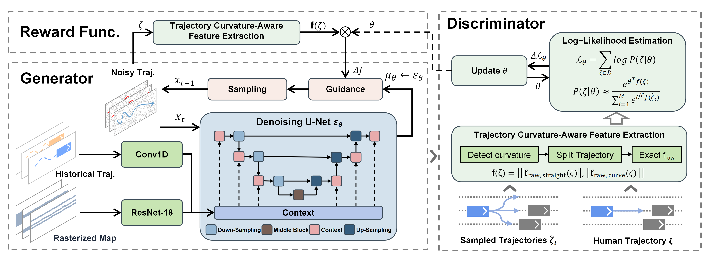
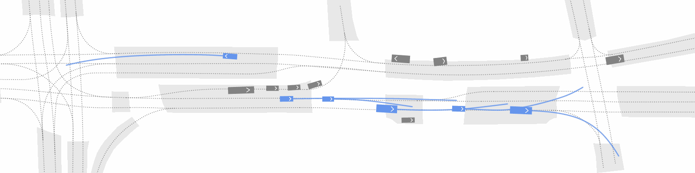
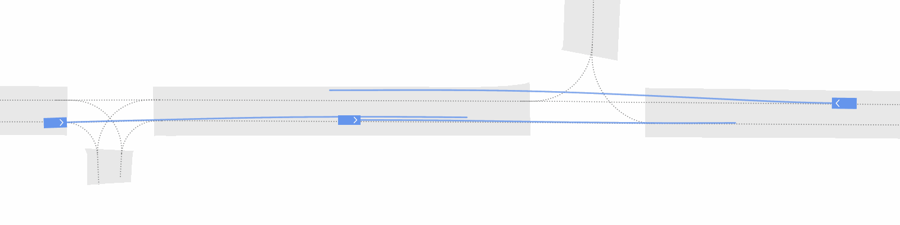
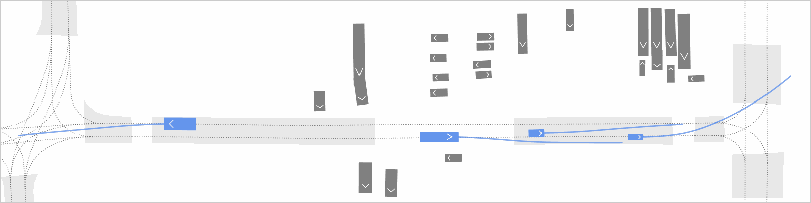
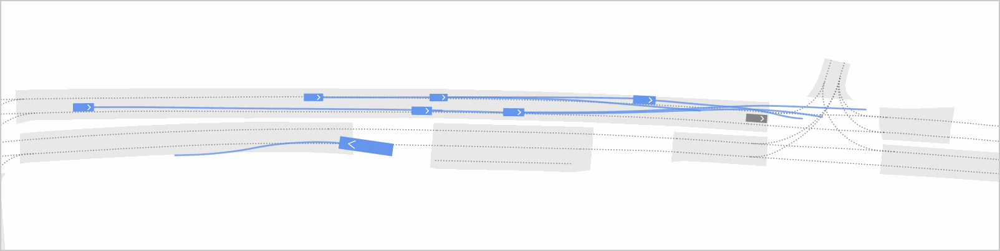
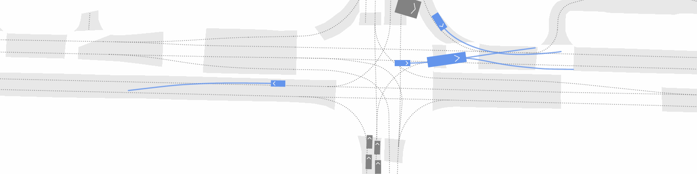

  <h1>DiffGAN</h1>
  <h2>GAN-Inspired Trajectory Generation by Inverse Reinforcement Learning-Informed Diffusion</h2>

## Table of Contents
- [Methods](#methods)
- [Simulation Results](#simulation-results)
- [Getting Started](#getting-started)
- 
## Methods
DiffGAN is a novel generative adversarial diffusion framework that combines diffusion models with inverse reinforcement learning (IRL) for realistic and diverse agent behavior modeling in autonomous vehicle simulation.

### Core Architecture
- **Generator:** Diffusion Model-based trajectory generation system that creates candidate trajectories for MaxEntIRL, with the inferred rewards used to guide the diffusion process.
- **Discriminator:** Maximum Entropy Inverse Reinforcement Learning implementation for inferring reward feature weights using linear combinations of features.

### Advantages
- Bridges the gap between discriminative learning (high realism) and generative learning (multimodal diversity).
- Produces agent behaviors that are both human-like and diverse

## Simulation Results

### Simulation on nuScenes-Boston

### Simulation on nuScenes-Singapore

## Getting Started
